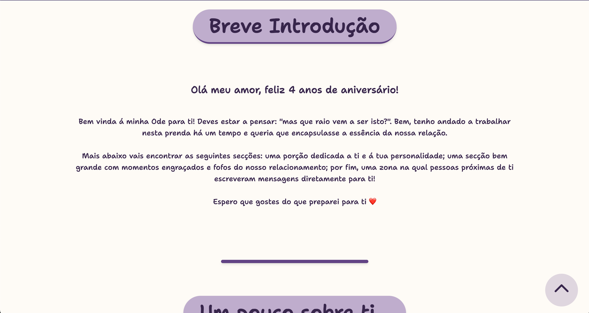
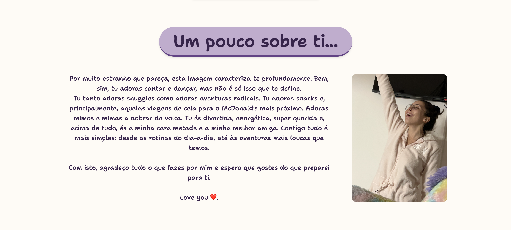
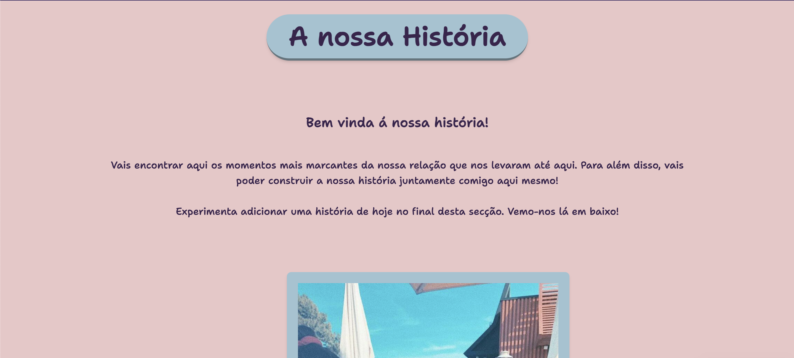
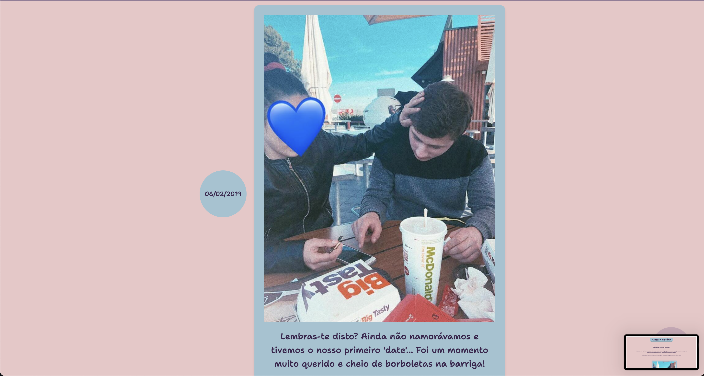
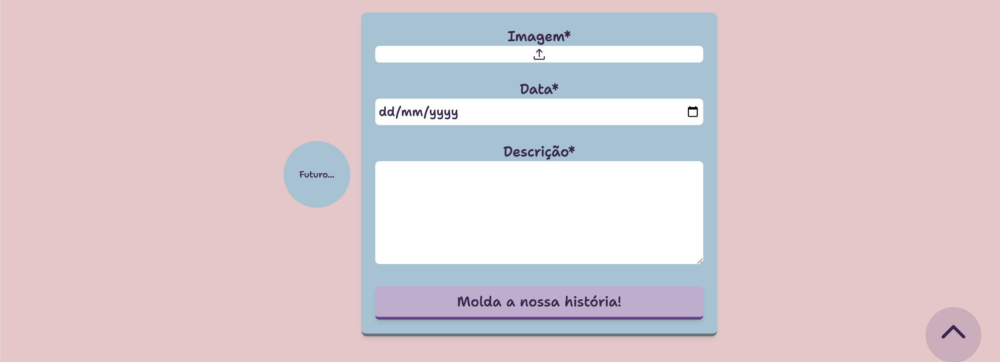
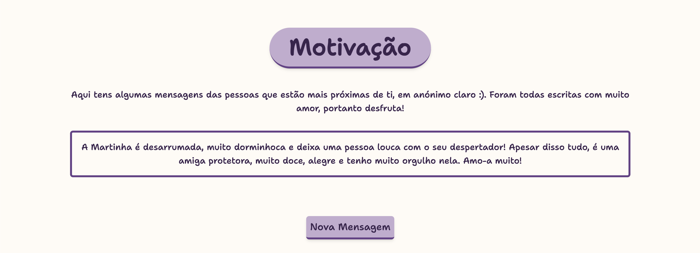

<!-- Improved compatibility of back to top link: See: https://github.com/othneildrew/Best-README-Template/pull/73 -->

<!--
*** Thanks for checking out the Best-README-Template. If you have a suggestion
*** that would make this better, please fork the repo and create a pull request
*** or simply open an issue with the tag "enhancement".
*** Don't forget to give the project a star!
*** Thanks again! Now go create something AMAZING! :D
-->

[![LinkedIn][linkedin-shield]][linkedin-url]

<!-- PROJECT LOGO -->
 

  

<h3 align="center">Ode</h3>

  

    A website gift for my girlfriend at our 4th year anniversary.
     
    <a href="https://maoaii.github.io/Ode/">View Demo</a>
    ·
    <a href="https://github.com/Maoaii/Ode/issues">Report Bug</a>
  

<!-- TABLE OF CONTENTS -->

  
Table of Contents

  <ol>
    <li>
      <a href="#about-the-project">About The Project</a>
      <ul>
        <li><a href="#built-with">Built With</a></li>
      </ul>
    </li>
    <li><a href="#roadmap">Roadmap</a></li>
    <li><a href="#license">License</a></li>
    <li><a href="#contact">Contact</a></li>
    <li><a href="#acknowledgments">Acknowledgments</a></li>
  </ol>

<!-- ABOUT THE PROJECT -->

## About The Project

HomePage

 
 
 

Introduction

 
 
 

About you Page

 
 
 

History Page header

 
 
 

History Page Elements

 
 
 

History Page Add Elements

 
 
 

Motivation Page

 
 
 

(<a href="#readme-top">back to top</a>)

### Built With

- [![HTML][html.com]][html-url]
- [![CSS][css.com]][css-url]
- [![JavaScript][javascript.com]][javascript-url]
- [![local_storage][local_storage.com]][local_storage-url]

(<a href="#readme-top">back to top</a>)

<!-- ROADMAP -->

## Roadmap

- [ ] Add a server for storage of history elements
- [ ] Add a login system

(<a href="#readme-top">back to top</a>)

<!-- CONTACT -->

## Contact

Lucas Girotto - l.girottoph@gmail.com

Project Link: [https://maoaii.github.io/Ode/](https://maoaii.github.io/Ode/)

(<a href="#readme-top">back to top</a>)

<!-- ACKNOWLEDGMENTS -->

## Acknowledgments

- [Heart Pre-loader](https://codepen.io/bbosmedia/pen/pZOqqP)

(<a href="#readme-top">back to top</a>)

<!-- MARKDOWN LINKS & IMAGES -->
<!-- https://www.markdownguide.org/basic-syntax/#reference-style-links -->

[linkedin-shield]: https://img.shields.io/badge/-LinkedIn-black.svg?style=for-the-badge&logo=linkedin&colorB=555
[linkedin-url]: https://linkedin.com/in/lucas-girotto-4530b9233
[product-screenshot]: images/screenshot.png
[html.com]: https://img.shields.io/badge/HTML-orange?style=for-the-badge&&logoColor=white
[html-url]: https://developer.mozilla.org/en-US/docs/Web/HTML
[css.com]: https://img.shields.io/badge/CSS-blue?style=for-the-badge&&logoColor=white

[CSS-url]: [https://developer.mozilla.org/en-US/docs/Web/HTML](https://developer.mozilla.org/en-US/docs/Web/CSS)

[javascript.com]: https://img.shields.io/badge/JS-yellow?style=for-the-badge&&logoColor=white
[javascript-url]: https://developer.mozilla.org/en-US/docs/Web/JavaScript
[local_storage.com]: https://img.shields.io/badge/local_storage-grey?style=for-the-badge&&logoColor=white
[local_storage-url]: https://developer.mozilla.org/en-US/docs/Web/API/Web_Storage_API
